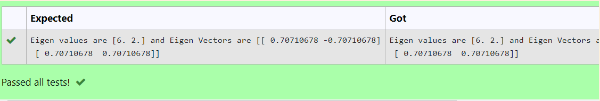

# EIGENVALUES-AND-EIGENVECTORS
## Aim:
To write a python program to find the Eigenvalues and Eigen Vectors
## Equipment’s required:
1. 	Hardware – PCs
2. 	Anaconda – Python 3.7 Installation / Moodle-Code Runner
## Algorithm:
### Step 1: 
Import numpy library
### Step 2: 
Assign the values to the arrays created
### Step 3:
Using the np.linalg.eig(),  we get two results (first is eigenvalue and second is eigenvector) of the given matrix.
### Step 4: 
End the program

## Program:
```
Eigenvalues and Eigenvectors
Name: Soundariyan M N
Register no: 22008347
```
```python
import numpy as np
a=([[4,2],[2,4]])
value,vector=np.linalg.eig(a)
print("Eigen values are {} and Eigen Vectors are {}".format(value,vector))
```
## Output:

## Result:
Thus the Eigenvalue and Eigenvector is successfully solved using python program
